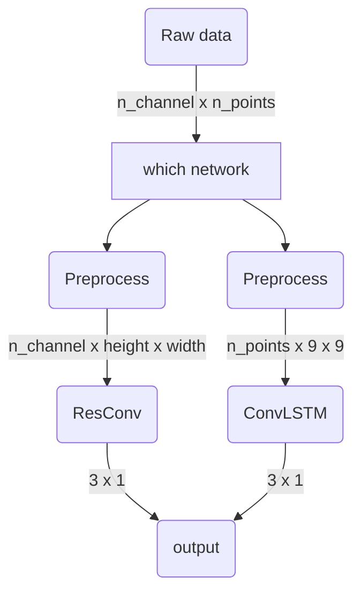
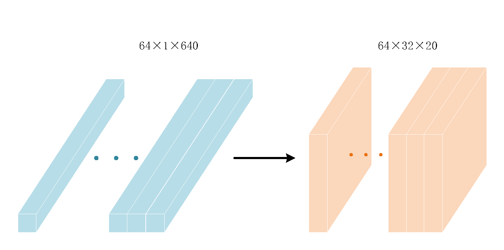
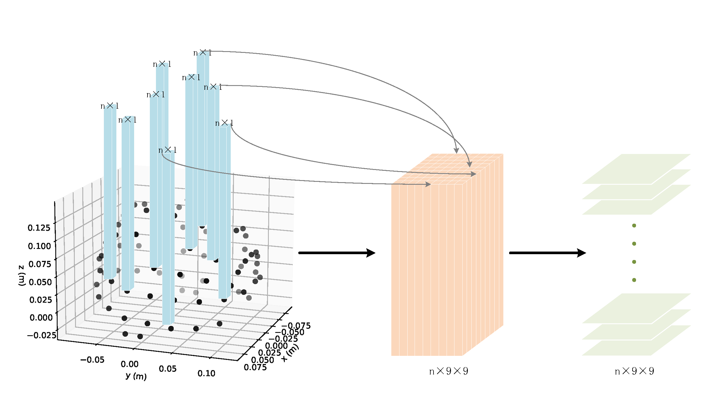

# EEG_Classification
EEG classification of imagined hand movements. BUAA三系模式识别与机器学习大作业

## Work Flow



## Dataset

Dataset [EEG Motor Movement/Imagery Dataset](https://archive.physionet.org/pn4/eegmmidb/) is used here. 


## MNE

To import data into python, we will use functions of the [MNE package](https://mne.tools/dev/index.html). MNE is an open-source Python package for exploring, visualizing, and analyzing human neurophysiological data.

EEG data can be considered in 3 different types: raw data, epoched data and evoked (averaged) data.

1. Raw Data: Continuous data is stored as a raw object in MNE. Data in a raw object are considered as a 2D array with dimensions of channels×time.
2. Epoched Data: This consists of time-locked trials. Data are a 3D array of events×channels×times.
3. Average Event Related Potentials: This is the result of averaging epoched data over trials. The output is time-locked to an external event, and it is stored as a 2D array of channels×times.

For more information, please refer to the [MNE document](https://mne.tools/dev/index.html).

## Preprocess

The raw data is proprocessed and turned into different forms according to what neural network is applied. 

* For ResCNN, the data shape is: `n_channel x height x width` 
* For ConvLSTM, the data shape is: `n_points x 9 x 9`

For the detail in preprocess, please refer to the [notebook](https://github.com/Bozenton/EEG_Motor_Imagery_Classification/blob/master/preprocess_in_detail.ipynb). 





## Usage 

First download the dataset by running the following script (it is from this [repo](https://github.com/SuperBruceJia/EEG-DL/blob/master/Download_Raw_EEG_Data/MIND_Get_EDF.py)): 

```sh
cd ./data/edf/
python MIND_Get_EDF.py
```

Then, preprocess the data

```sh
cd ../..
python preprocess_ResCNN.py
python preprocess_ConvLSTM.py
```

train the networks

```sh
python main_ResCNN.py
python main_ConvLSTM.py
# during training you can visulize by tensorboard:
tensorboard --logdir ResCNN_tensorboard
tensorboard --logdir ConvLSTM_tensorboard
```

predict

```sh
python predict_ResCNN.py
python predict_ConvLSTM.py
```

you can draw the confusion matrix and get the values of precision, recall and f1 score by this [script](https://github.com/Bozenton/EEG_Motor_Imagery_Classification/blob/master/utils/draw_confusion_matric.py): 

```sh
cd utils
python draw_confusion_matric.py
```

## Reference

[1] Max O Krucoff, Shervin Rahimpour, Marc W Slutzky, V Reggie Edgerton, and Dennis A Turner. Enhancing nervous system recovery through neurobiologics, neural interface training, and neurore-habilitation. Frontiers in neuroscience, 10:584, 2016.

[2] François Perrin, Jacques Pernier, O Bertrand, and Jean Francois Echallier. Spherical splines for scalp potential and current density mapping. Electroencephalography and clinical neurophysiology, 72(2):184–187, 1989.

[3] PhysioToolkit PhysioBank. Physionet: components of a new research resource for complex physiologic signals. Circulation, 101(23):e215–e220, 2000.

[4] Xingjian Shi, Zhourong Chen, Hao Wang, Dit-Yan Yeung, Wai-Kin Wong, and Wang-chun Woo. Convolutional lstm network: A machine learning approach for precipitation nowcasting. Advances in neural information processing systems, 28, 2015.

[5] Wikipedia contributors. Brain–computer interface — Wikipedia, the free encyclopedia. https://en.wikipedia.org/w/index.php?title=Brain%E2%80%93computer_interface&oldid=1086877861, 2022. [Online; accessed 30-May-2022

The code of ConvLSTM refers to this [repo](https://github.com/automan000/Convolutional_LSTM_PyTorch)