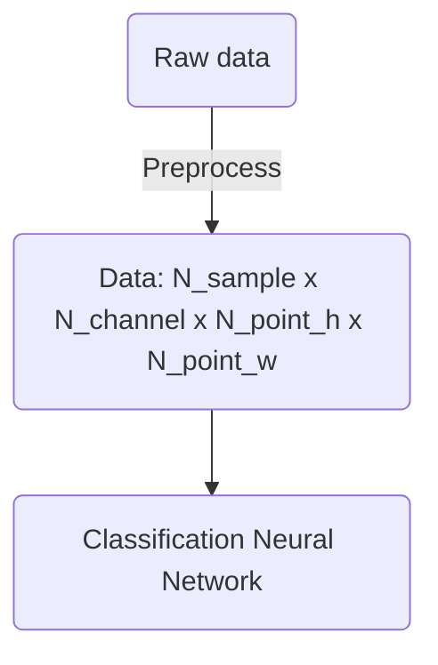

# EEG_Classification
EEG classification of imagined hand movements. BUAA三系模式识别与机器学习大作业

## Work Flow



## Dataset

Dataset [EEG Motor Movement/Imagery Dataset](https://archive.physionet.org/pn4/eegmmidb/) is used here. 


## MNE

About MNE:

EEG data can be considered in 3 different types: raw data, epoched data and evoked (averaged) data.

1. Raw Data: Continuous data is stored as a raw object in MNE. Data in a raw object are considered as a 2D array with dimensions of channels×time.

2. Epoched Data: This consists of time-locked trials. Data are a 3D array of events×channels×times.

3. Average Event Related Potentials: This is the result of averaging epoched data over trials. The output is time-locked to an external event, and it is stored as a 2D array of channels×times.

## Preprocess

The raw data is proprocessed and turned into different forms according to what neural network is applied. 

* For CNN, the data shape is: `N_sample × N_channel × N_point_h × N_point_w` 
* For RNN, the data shape is: 
* For Transformer, the data shape is: 

## Usage 

First download the dataset by running the following script (it is from this [repo](https://github.com/SuperBruceJia/EEG-DL/blob/master/Download_Raw_EEG_Data/MIND_Get_EDF.py)): 

```sh
cd ./data/edf/
python MIND_Get_EDF.py
```

